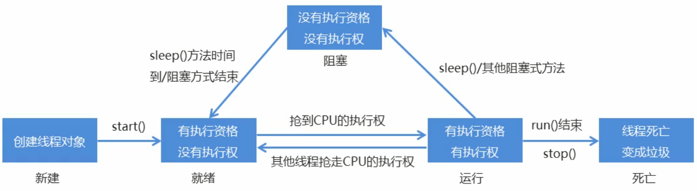

**1.线程:是正在运行的程序**   
* 是系统进行资源分配和调度的基本单位     
* 每一个进程都有它自己的内存空间和系统资源

**2.线程：是进程中的单个顺序控制流，是一条执行路径**   
* 单线程：一个进程如果只有一条执行路径，则称为单线程程序       
* 多线程：一个进程如果只有一条执行路径，则称为单线程程序       

**3.线程调度**
* 分式调度模型：所有线程轮流使用CPU的使用权，平均分配每个线程占用CPU的时间片
* 抢占式调度模型：优先让优先级高的线程使用CPU，如果线程优先级相同，那么随机选择一个
* 因此多线程程序的执行是有随机性的

**4.线程五态图**

**5.与Thread相比，Runnable的优点**
* 避免JAVA单继承的局限性
* 适合多个相同程序的代码去处理同一个资源的情况，把线程和程序的代码、数据有效分离
，较好的体现了面向对象的设计思想

**6.线程安全的类**
* StringBuffer：
  * 线程安全，可变的字符序列
  * 从JDK5开始被StringBuilder代替，StringBuilder类更快，因为它不执行同步操作
* Vector
  * 该类改进了List接口，与新的集合实现不同，Vector被同步。
  * 如果不需要线程安全的实现，建议使用ArrayList代替Vector
* Hashtable
  * 该类实现了一个哈希表，它将键映射到值。任何非null对象都可以用作键或值
  * 该类改进了Map接口，Hashtable会被同步
  * 不需要线程安全的实现，建议使用HashMap代替