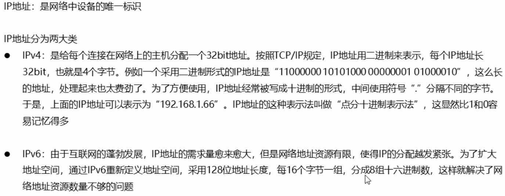
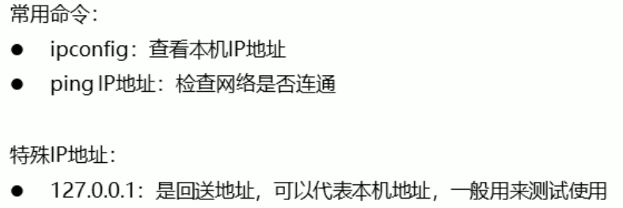
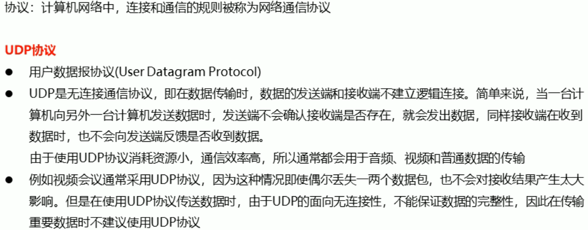
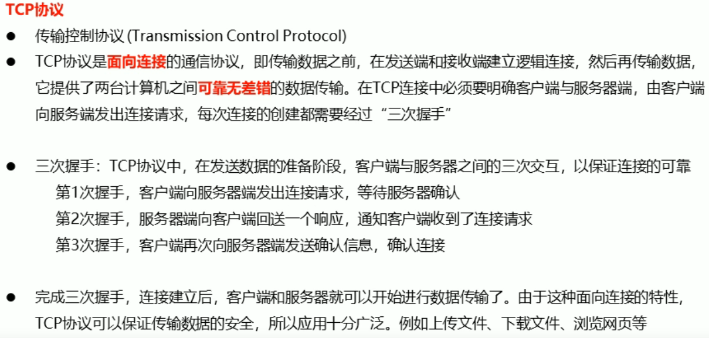
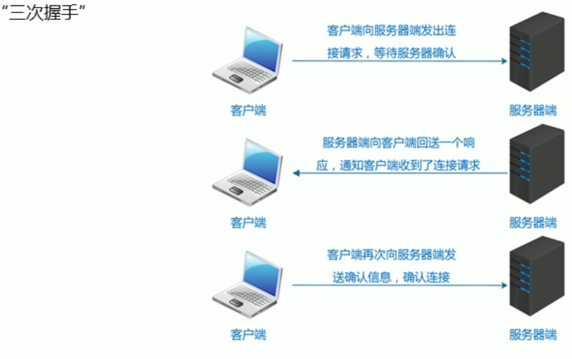

**1.计算机网络**
* 是指将地理位置不同的具有独立功能的多台计算机及其外部设备，通过通信线路连接起来，在网络操作系统，
网络管理软件及网络通信协议的管理和协商下，实现资源共享和信息传递的计算机系统

**2.网络编程**
* 在网络通信协议下，实现网络互连的不同计算机上运行的程序间可以进行数据交互

**3.网络编程三要素**
* IP地址
  * 要想让网络中的计算机能够相互通信，必须为每台计算机指定一个标识号，通过这个标识号来指定要接受数据的
计算机和识别发送的计算机，而IP地址就是这个标识号。也就是设备的标识

* 端口
  * 网络通信本质上是两个应用程序的通信。每台计算机都有很多的应用程序，通过端口号可以唯一标识
设备中的应用程序。也就是应用程序的标识
  
* 协议
  * 通过计算机网络可以使多台计算机实现连接，位于同一个网络中的计算机在进行连接和通信时
需要遵守一定的规则，其被称为网络通信协议，它对数据的传输格式、传输速率、传输步骤等做了统一规定
通信双方必须共同遵守。常见的有UDP、TCP协议
  
  
  